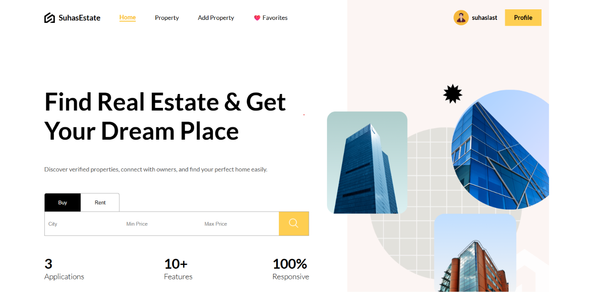
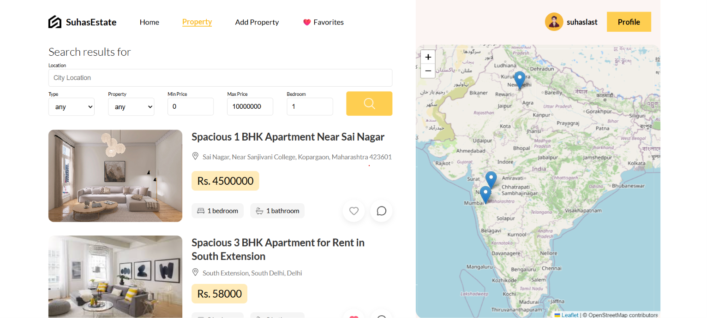
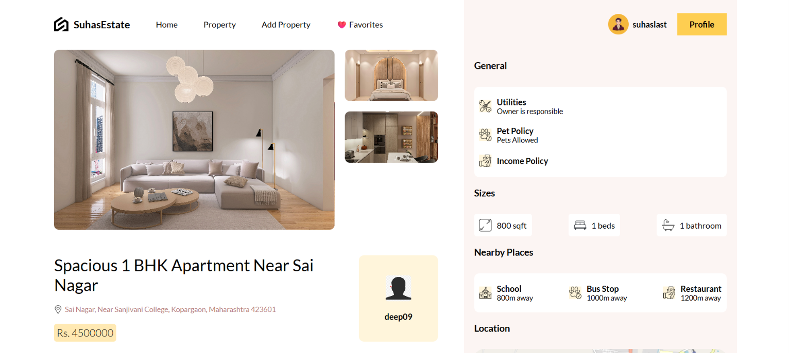
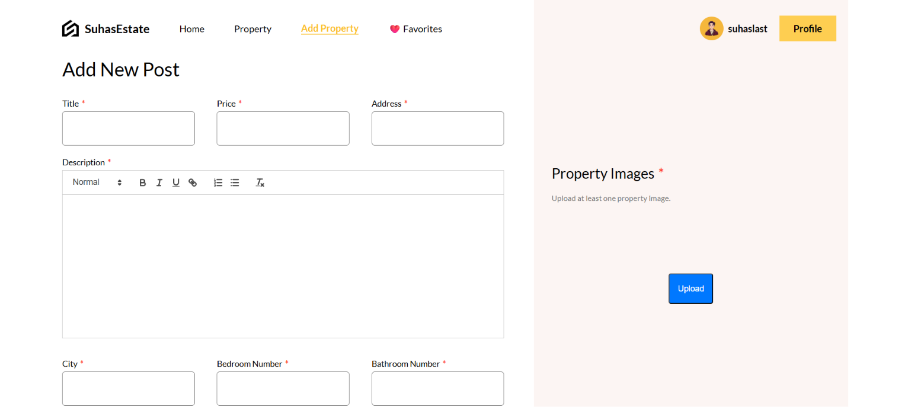
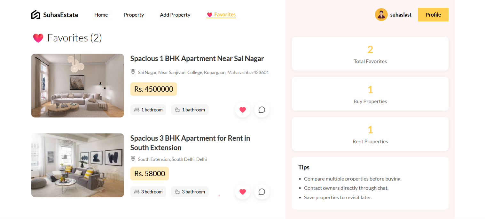
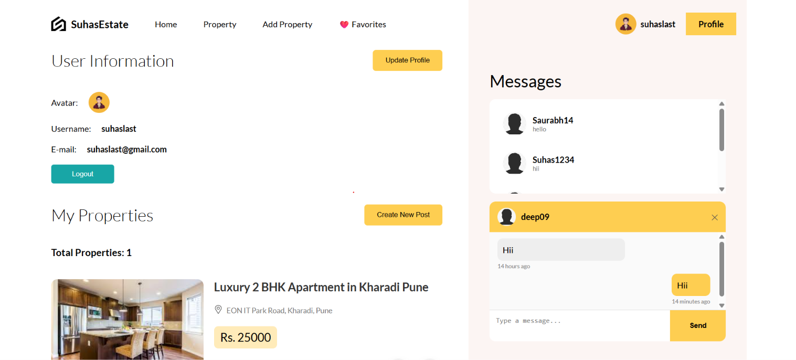
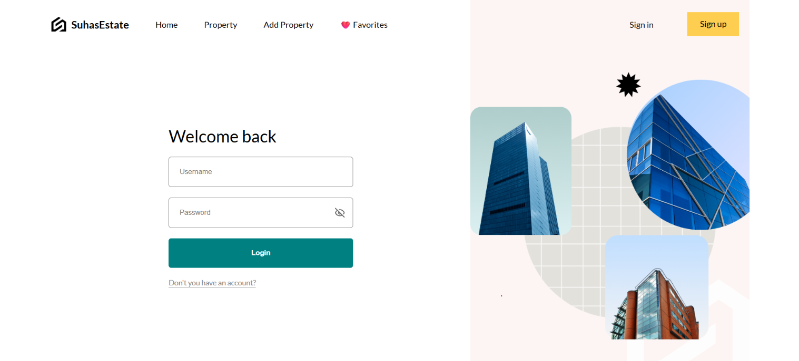

# 🏠 Real Estate Platform

A full-stack real estate web application built using the MERN stack that allows users to browse, search, save, and manage property listings. The platform also includes real-time messaging between property owners and interested users.

## 🌐 Live Demo

**Frontend:** Coming Soon...

**Backend API:** Coming Soon...

## ✨ Features

- User registration and login
- JWT-based authentication
- Create property listings
- Update property listings
- Delete property listings
- Search and filter properties
- Filter by city, property type, price, and bedrooms
- Save and remove favorite properties
- Dedicated favorites page
- Real-time chat between users and property owners
- Real-time message notifications
- Property image uploads using Cloudinary
- Interactive property maps using Leaflet
- Responsive design for desktop, tablet, and mobile devices
- User profile management

## 🛠️ Tech Stack

### Frontend

- React.js
- React Router
- JavaScript
- SCSS
- Axios
- Zustand
- React Quill
- React Leaflet
- Socket.IO Client

### Backend

- Node.js
- Express.js
- Prisma ORM
- MongoDB
- JWT Authentication
- bcrypt

### Real-Time Communication

- Socket.IO

### Cloud Services

- MongoDB Atlas
- Cloudinary

## 📸 Screenshots

### Home Page



### Property Listing



### Property Details



### Add Property



### Favorites



### Profile-Messages



### Update Property


### Login



### Register


## 📁 Project Structure

```text
mern-real-estate-platform/
│
├── api/                    # Express.js backend
│   ├── controller/
│   ├── lib/
│   ├── middleware/
│   ├── prisma/
│   ├── routes/
│   └── app.js
│
├── client/                 # React frontend
│   ├── public/
│   └── src/
│       ├── components/
│       ├── context/
│       ├── lib/
│       └── routes/
│
├── socket/                 # Socket.IO server
│   └── app.js
│
└── README.md
```

## 🚀 Installation

Clone the repository

```bash
git clone https://github.com/suhas1409/mern-real-estate-platform.git
```

Install backend

```bash
cd api
npm install
```

Install frontend

```bash
cd ../client
npm install
```

Install socket server

```bash
cd ../socket
npm install
```

## ▶️ Run Locally

Backend

```bash
cd api
npm start
```

Frontend

```bash
cd client
npm run dev
```

Socket Server

```bash
cd socket
node app.js
```

## 🔐 Environment Variables

Backend (`api/.env`)

```env
DATABASE_URL=
JWT_SECRET_KEY=
CLIENT_URL=
```

Frontend (`client/.env`)

```env
VITE_API_URL=
```

## 👨‍💻 Author

**Suhas Bhavsar**

GitHub: https://github.com/suhas1409
